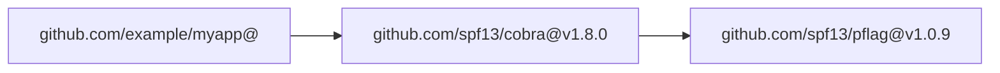

# Output Formats

`mdv export` and `mdv analyse` support three output formats.

---

## JSON (Schema v1.1)

The JSON format is the canonical, machine-readable representation of the dependency graph. It is the source format that powers all other exporters.

```bash
mdv analyse . --format json
mdv export . --format json -o snapshot.json
```

See the full [JSON Schema reference](/schema) for field definitions and versioning policy.

**Sample output**

```json
{
  "schema_version": "1.1.0",
  "generated_at": "2024-11-01T10:00:00Z",
  "project": {
    "name": "github.com/example/myapp",
    "language": "go",
    "root_path": "/path/to/project",
    "main_module": "github.com/example/myapp"
  },
  "nodes": [
    {
      "id": "github.com/spf13/cobra@v1.8.0",
      "name": "github.com/spf13/cobra",
      "version": "v1.8.0",
      "kind": "module",
      "indirect": false,
      "replaced_by": null,
      "metadata": {}
    }
  ],
  "edges": [
    {
      "from": "github.com/example/myapp@",
      "to": "github.com/spf13/cobra@v1.8.0",
      "kind": "depends_on",
      "metadata": {}
    }
  ],
  "stats": {
    "node_count": 8,
    "edge_count": 12,
    "max_depth": 3,
    "has_cycles": false
  }
}
```

---

## Graphviz DOT

Produces a `.dot` file renderable with any [Graphviz](https://graphviz.org)-compatible tool.

```bash
mdv export . --format dot | dot -Tsvg -o deps.svg
mdv export . --format dot | dot -Tpng -o deps.png
mdv export . --format dot > graph.dot && xdot graph.dot
```

**Suitable for:**
- Graphs with hundreds to thousands of nodes
- CI pipeline artifact generation
- Custom styling via DOT attributes

---

## Mermaid

Produces a [Mermaid](https://mermaid.js.org) diagram that renders natively in GitHub Markdown, Notion, Confluence, and most modern documentation tools.

```bash
mdv export . --format mermaid
```

**Sample output**

````

````

**Suitable for:**
- GitHub PR descriptions and READMEs
- Notion and Confluence pages
- Documentation that needs inline diagrams

::: warning
Mermaid renders reliably up to **~500 nodes**. For larger graphs use `--format dot` and render with Graphviz.
:::

---

## Choosing a Format

| Format | Best for | Size limit |
|---|---|---|
| `json` | CI pipelines, custom tooling, archiving | No limit |
| `dot` | Large graphs, SVG/PNG rendering | No practical limit |
| `mermaid` | GitHub Markdown, Notion, inline docs | ~500 nodes |
